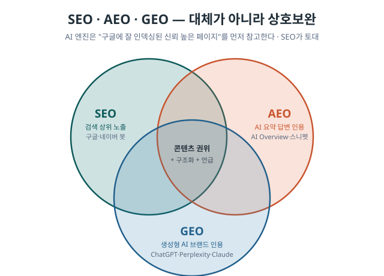
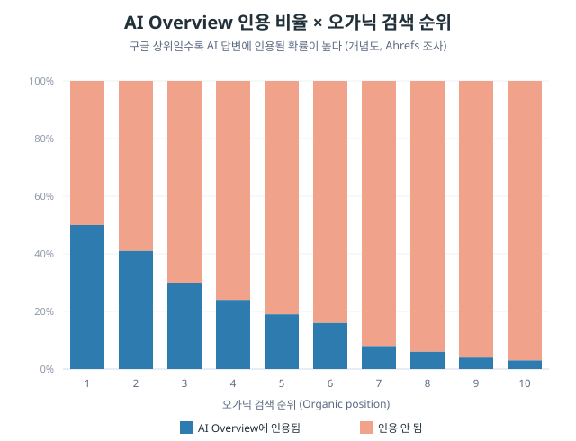
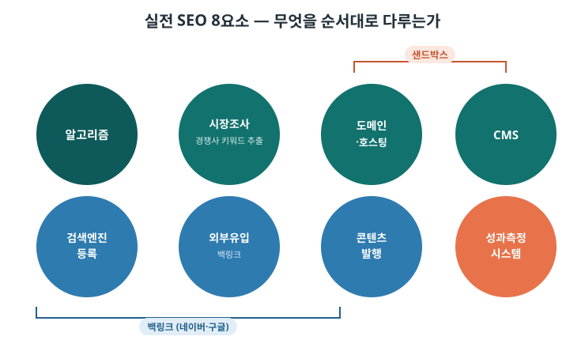
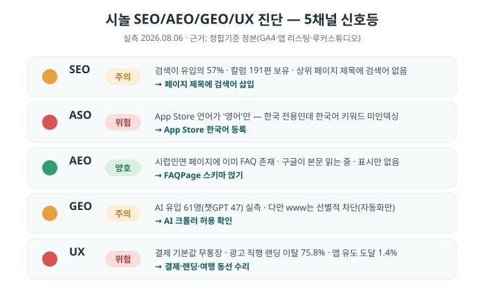
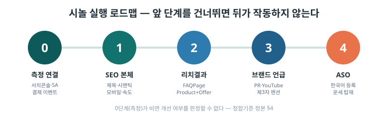

# 시놀 SEO · AEO · GEO 학습 정리 — 2026-08-27

> **이 문서의 목적** — 시놀 대표·실무자·Cowork가 **SEO / AEO / GEO / ASO의 기본기와 실전**을 한 번에 학습하도록
> 최근 공유된 교육자료·실측 진단을 하나로 정리한 **학습 정본(base)** 입니다.
> **다음 단계** — Cowork가 이 문서 + 최신 작업을 반영해 **학습용 HTML 한 개**로 확장합니다. (§부록 A: HTML 제작 가이드)

| 항목 | 내용 |
|---|---|
| 대상 | 대표(경영 판단) · 실무자(PO·개발·디자인·마케팅) · Cowork(HTML 제작) |
| 성격 | 교육/학습 자료 (실행 지시서 아님 — 실행은 별도 One-pager·티켓) |
| 수치 출처 | **시놀 수치는 전부 `docs/03_정합기준_정본_2026-08.md`에서 인용** · 방법론은 외부 교육자료 |
| 신뢰도 표기 | `확정 / 유력 / 추정 / 미확인` 4단계 |
| ⚠️ 저작권 | 타 프로젝트(어바웃피싱·한국콜마BNH 등) 사례는 **방법론 예시**로만 사용. 시놀 산출물에 타사 명칭·실적을 옮기지 않음 |

---

## 0. 한 장 요약 (TL;DR)

1. **AI 검색은 SEO를 대체하지 않는다.** GEO/AEO는 SEO의 **확장**이다 — ChatGPT 인용의 **88.46%가 일반 검색 인덱스에서 발생**.
2. 그래서 **순서가 있다**: ① 측정 연결 → ② SEO 본체(제목·구조·속도) → ③ 스키마(리치결과) → ④ 브랜드 언급(제3자).
3. **시놀의 0단계가 비어 있다.** 서치콘솔·서치어드바이저 **미연결**, 결제 이벤트 **7개월 20건**, 네이버 전환추적 **미설치** — *이 상태로 화면을 바꾸면 개선 여부를 판정할 수 없다*(정본 §4).
4. **가장 큰 기회는 운세다.** '오늘의운세' 월 **525만** 검색을 시놀이 이미 앱 안에 보유(사주·운세) — 만들 것 없이 **이름만 붙이면 되는 유입구**.
5. **자산은 이미 있다.** 칼럼 191편·단체미팅 페이지(이탈 12.0%)·언론 보도 — 새로 만들기 전에 **있는 것을 검색어와 연결**하는 것이 먼저.

---

## 1. 기초 — SEO · AEO · GEO · ASO는 무엇이고 왜 다 필요한가

사용자가 검색하는 **경로마다 최적화 대상이 다릅니다.** 하나가 아니라 **여러 독자에게 동시에 말하는 것**이 핵심입니다.

| 구분 | 목표 | 사용자 행동 | 최적화 대상 | 핵심 지표 |
|---|---|---|---|---|
| **SEO** (Search Engine Optimization) | 구글·네이버 검색 상위 노출 | '5060 소개팅' 검색 → 링크 클릭 → 방문 | 구글 봇·네이버 봇 | 순위·CTR·오가닉 트래픽 |
| **AEO** (Answer Engine Optimization) | 구글 AI Overview·Featured Snippet 노출 | '결정사 비용' 검색 → **AI 요약만 읽음** | 구글 AI Overview·네이버 AI답변 | 제로클릭 노출·답변 내 인용 |
| **GEO** (Generative Engine Optimization) | ChatGPT·Perplexity 답변에 **브랜드 인용** | 'AI에게 물어봄' | LLM (ChatGPT·Gemini·Claude) | AI 인용 횟수·브랜드 멘션 |
| **ASO** (App Store Optimization) | 앱스토어 검색 노출·설치 전환 | 스토어에서 '소개팅 어플' 검색 | Play·App Store 검색 | 노출·설치·리뷰 |

> **핵심 원칙**: *SEO가 탄탄해야 GEO/AEO가 작동한다.* AI 엔진이 답을 만들 때 가장 먼저 참고하는 것은 **구글에서 잘 인덱싱된 신뢰도 높은 웹페이지**다. 세 가지는 대체 관계가 아니라 **상호보완**이다.

---

## 2. 2026 트렌드 — 반드시 알아야 할 5가지 결론

> *출처: Ahrefs 조사(ahrefs.com/blog/llm-visibility) 개념 재구성 — 수치는 근사값.*

1. **AI 검색은 기존 SEO를 대체하지 않는다.** GEO/AEO는 SEO의 확장. **ChatGPT 인용의 88.46%가 일반 검색 인덱스에서 발생.** `신뢰도: 외부 조사`
2. **SEO + GEO 병행이 정답.** Google이 ChatGPT보다 웹 트래픽을 **약 190배** 더 발생시킴 → 당분간 SEO를 중심에 두고 AI 가시성을 **추가**.
3. **백링크보다 '브랜드 언급'이 중요해짐.** Digital PR·YouTube·커뮤니티·언론에서 **많이 이야기되는 구조**가 핵심.
4. **'우리가 최고'라는 자사 콘텐츠는 효과 제한적.** AI가 그 글을 인용하면서도 **경쟁사를 추천**할 수 있음 → **제3자가 나를 언급하게** 만드는 전략.
5. **llms.txt와 Schema는 GEO의 '핵심 해법'이 아니다.** llms.txt의 **97%가 크롤러에게 안 읽힘**, Schema도 단기 AI 인용 증가 효과 미확인. *(스키마는 리치결과용으로 여전히 유효 — "그것만으로 AI 인용이 늘지 않는다"는 뜻)*

**AI 가시성 상관계수** (참고): 백링크 0.19~0.24 · **YouTube 언급 0.74** · 웹 브랜드 언급 0.66~0.71 → **언급량이 백링크보다 강한 신호.**

**체류시간(dwell time) 관점** — 웹사이트 평균 ~1분, 네이버 2~3분, **AI 유입 트래픽 5~7분.** AI로 들어온 방문자는 **체류가 길다 = 고관여**. (고관여 구매니즈는 통상 체류 2~3분 이상에서 발생) → 시놀 AI 유입이 아직 61명(정본 §3)으로 작아도 **질이 높은 트래픽**일 수 있음.

**성과측정 현실** (973개 e커머스 조사, 함부르크대 논문): 생성 AI 트래픽의 구매전환율은 **생각보다 낮음** — LLM 유입 RPS 약 1,950원/섹션 vs 오가닉 검색 약 2,262원/섹션. → **GEO는 "인지·발견" 채널, 최종 전환은 여전히 SEO/검색이 주력.**

**하지 말 것 (블랙햇)**: 이력서 프롬프트 숨김, Preference Manipulation Attack, Memory Poisoning/Prompt Injection, 지역 트래픽 어뷰징(불특정 다수 질문·답변 반복). — 단기 효과 있어 보여도 **정책 위반·신뢰 훼손**.

---

## 3. 실전 파이프라인 — 무엇을 순서대로 다루는가

### 3-1. 8요소 지도

- **샌드박스 구간** = [3] 도메인·호스팅 + [4] CMS (신규 도메인 초기 노출 지연)
- **백링크(네이버·구글)** = [5] 검색엔진 등록 + [6] 외부유입 / **사이트맵**은 [5]의 기초

### 3-2. 사전진단 — 두 갈래

**A. 기존 홈페이지 보유 사업자 (← 시놀이 여기)**
1. **sitemap.xml** 상태 확인
2. **robots.txt** 상태 확인
3. **구글 서치콘솔** 연결
4. **네이버 서치어드바이저** 연결

**B. 새로 만드는 사업자**
- 자체 구축 / 워드프레스(국내보다 해외가 저렴) / **바이브 코딩(볼트·리플릿·러버블)**

### 3-3. 도메인·URL 구조 — "처음부터 짜라"

| 형태 | 예시 | 성격 |
|---|---|---|
| 루트 도메인 | `example.co.kr` | 최상위 권위 |
| 서브 도메인 | `blog.example.co.kr` | 검색엔진이 **별개 사이트**로 인식 → 권위 분산 가능 |
| 디렉토리 | `example.co.kr/blog` | 루트 권위를 **그대로 이어받음** |

- **도메인 구입 원칙**: **1년 미만 신규 도메인은 높은 확률로 샌드박스** → 콘텐츠 노출 지연.
- **표준화 실물 예시**(외부): `robots.txt`에 `User-agent: * / Disallow: /wp-admin/ / Allow: /wp-admin/admin-ajax.php / Sitemap: …/sitemap_index.xml`, 사이트맵 색인은 post·page·**dictionary(용어집)** 등으로 분리. → **용어집을 별도 사이트맵으로 색인**하는 패턴에 주목.

### 3-4. CMS 선택 매트릭스

| 목적 | 선택지 | 유의점 |
|---|---|---|
| **B2B** (상담→세일즈→계약) | 워드프레스 · 아임웹 · 인블로그 | **아임웹은 JS 기반 → 향후 AI/검색 크롤러가 본문을 못 읽을 리스크** · 자체 홈페이지는 유지비 큼(robots·sitemap 관리 부담) |
| **쇼핑몰** | 제품 少 = 워드프레스 / 제품 多 = 쇼피파이 / 한국 = 카페24(전문가 손길) | 자체구축은 표준화 안 돼 손 많이 감 |
| **플랫폼** (하이브리드앱·웹앱·네이티브앱) | — | 초급 난이도. 앱검색·플레이스토어·앱스토어·웹·AI를 **유기적으로 초기 설계** |

> **시놀 연결**: 시놀 웹은 **아임웹 유력**(정본 §7 — 칼럼 URL `?bmode=view&idx=`·`doz_` 접두). 사실이면 `<head>` 코드 삽입·페이지별 메타·GTM 설치가 **가능**. 다만 **여가 탭의 운세(silovesaju)·클래스(sinorclass)가 외부 JS 페이지**라면 위 "아임웹 JS 리스크"와 동일하게 **크롤러 가독성**을 확인해야 함. `신뢰도: 유력(플랫폼) / 미확인(여가 외부페이지 렌더링)`

---

## 4. SEO 코드 7계층 — "왜 이렇게 짜는가" (실무 교본 요약)

크롤러는 `<head>`부터 위→아래로 읽고, **위에 있을수록 중요**하다고 판단합니다. 각 계층은 서로 다른 독자를 위해 존재합니다.

| 계층 | 독자 | 핵심 규칙 |
|---|---|---|
| **① `<head>` 메타** | 구글·네이버 봇 | **title 맨 앞에 검색어**(브랜드는 뒤 `|`) · description 155자 이내 · `canonical`로 원본 URL 지정 |
| **② JSON-LD `@graph`** | 리치결과 엔진 | LocalBusiness+FAQPage+ItemList를 **하나의 script**에 묶음 |
| **③ Microdata (Product+Offer)** | 상품 크롤러 | **`price`는 반드시 `Offer` 안에** (Product 직속이면 서치콘솔 에러: "offers/review/aggregateRating 필요") |
| **④ 이미지 `alt`** | 이미지 검색 봇 | 전부 **핵심 키워드로 시작** + **모두 고유**(중복 = 키워드 스터핑=스팸) |
| **⑤ HTML 시맨틱** | 모든 크롤러 | `h1` **페이지당 1개** · 상품 카드는 `<article>` · 위→아래 = 중요도 순 |
| **⑥ 링크·CTA** | 구글 + 사용자 | 내부 링크를 **한 URL에 집중**(PageRank 집중) · 버튼 앵커텍스트에 키워드("자세히 보기" ✕) |
| **⑦ OG / Twitter Card** | SNS 크롤러 | `og:image`는 **절대 URL 필수**(상대경로면 SNS 인식 실패) · `twitter:card=summary_large_image` |

**기술 SEO 보강**: `loading="lazy"`(히어로만 `eager`) · `preconnect`(폰트) · **모바일 퍼스트 인덱싱**(2019~) · 이미지 30일 캐시.

**title 처방 예시** (규칙 적용): `시럽인연` → **`중장년 결혼정보 시럽인연 | 50·60대 재혼 상담 · 성혼비 없음`**
- ⚠️ 흔한 실수: 브랜드를 앞에(`시럽인연 | …`). **브랜드 인지도 낮은 초기엔 키워드가 앞.**

> **배포 전 체크리스트 14** (요지): title 키워드 앞·description 155자·canonical·JSON-LD 유효·**Product에 Offer**·모든 img에 alt·alt 고유·**og:image 절대 URL**·h1 1개·모바일 안 잘림·PageSpeed 모바일 70+·sitemap·robots 허용.
> **검증 도구**: 리치결과 테스트 · 서치콘솔 · PageSpeed Insights · Schema Validator · 네이버 웹마스터.

---

## 5. ASO + 키워드 전략 — 시놀·시럽인연 (네이버 키워드도구 실측)

### 5-1. 가장 큰 발견 — 운세

| 키워드 | 월간 검색수 | 시사점 |
|---|---|---|
| **오늘의운세** | **5,249,500** | 결정사(11,020)의 **476배** · 시놀이 **이미 앱에 보유** |
| 운세 계열 합계 | 11,251,335 (키워드 385개) | 만들 것 없이 이름만 붙이면 되는 유입구 |
| 사주 | 118,100 | 시놀 보유 |
| 궁합 계열 합계 | 63,100 | **미보유** — 사주 데이터로 소규모 개발 시 진입 가능 |

- 웹 `오늘의운세` 페이지가 **최대 채널**(순수 전환은 웹이 정답). 유입 규모 목적이면 Google Play 이름에도 '운세' 탑재(단, 설치 후 이탈 상쇄 위해 앱 첫 화면 가까이 노출).
- **궁합은 현재 미보유** → 스토어 문구에서 전량 제외(없는 기능 표기 = 정책 위반).

### 5-2. 네이버 복합 키워드 원칙
- 검색량 있는 단어를 **앞에** · 함께 검색되는 단어는 **붙여서**(`5060 만남`·`5060 소개팅`).
- `5060`은 반드시 붙여서 — `5060`(10,660)과 `50대`/`60대`(각 수백)는 **20배** 차이.
- `시니어` 단독은 **일자리·모델** 의도가 섞임 → **`시니어 5060`** 으로 분리.
- 5080(치약)·마담4060(의류)·나는솔로(TV)처럼 **검색량 커도 맥락 다른 것은 제외**.

### 5-3. 시놀 4개 리스팅 현황 (정본 §6, 2026.08.06) — `신뢰도: 확정`

| 항목 | 시놀 Play | 시놀 App Store | 시럽 Play |
|---|---|---|---|
| 설치 | 10,000+ | 비공개 | 50,000+ |
| 등록 언어 | 한국어 | **영어(EN)만 ⚠️** | 한국어 |
| 연령 등급 | 12+ | 15+ | **18+** |
| 데이터 안전 | 암호화 안 됨 | — | 암호화 안 됨 + **개인정보·금융정보 제3자 공유 ⚠️** |

**최우선 조치**: ① **App Store 한국어 등록**(한국 전용인데 한국어 키워드 미인덱싱) → ② 데이터 안전 재제출 → ③ iOS 리뷰 확보(Play 154 vs iOS 10) → ④ 제목에 실측 검색어(`5060`).

### 5-4. AEO(질의응답) 원칙
- **실제 검색어를 그대로 질문 제목으로** ("결정사 비용은 얼마인가요?").
- **첫 문장에서 답을 끝낸다**(AI는 문단 앞부분만 발췌).
- **숫자·고유명사**를 넣는다(회원 수·성혼비 0원).
- 질의응답 **5개 이내**(과반복=스팸) · **스토어 상세 하단 + 웹 FAQ(FAQPage JSON-LD)** 두 곳에.

> **시놀 수치 주의**: 마케팅 문구의 "회원 11만"은 **대외 표기값**. 정본 확정치는 **누적 107,735명**(시럽 49,862·시놀 57,873), 시럽인연 **표기** 46,366명(사이트 표기·유력). 문구 작성 시 **정본 값 + "사이트 표기" 병기.**

---

## 6. 실무 워크플로우 — 저비용으로 빠르게, 측정으로 회수

**웹사이트 제작 루프** (실무자 메모):
1. **AI 코딩(러버블·리플릿·볼트)** 으로 1차 초벌 → 2. **Fiverr 글로벌 외주 ~50만원**으로 마감 → 3. **AI 트래픽 → 영업이익 → 재투자.**
- 과거엔 AI 코딩이 초창기였으나, **지금은 러버블·볼트 효능이 크게 향상** → 전문가 100 기준 **AI 단독 70~80** 수준. 운용은 **세미컨설팅(완성본에서 디테일만 보강).**
- **콘텐츠 제작 방식**: 81.9%가 **인간+AI 혼합**(지배적 AI 7.8%) — "전량 AI"가 아니라 **사람이 AI를 활용**하는 것이 주류.

⚠️ **리스크(§3-4와 동일)**: AI 코딩 산출물이 **JS 과의존(SPA)** 이면 크롤러가 본문을 못 읽을 수 있음 → **SSR/프리렌더·표준화(robots·sitemap)** 를 반드시 게이트로.

---

## 7. 시놀 현주소 — 5채널 진단 (정본 대조) `신뢰도: 확정(실측)`

| 채널 | 등급 | 지금 상태 (실측) | 가장 큰 한 가지 |
|---|---|---|---|
| **SEO** | 주의 | 검색이 유입의 **57%**, 칼럼 191편 자산 보유. 상위 페이지 제목이 브랜드만 있고 검색어 없음 | **페이지 제목에 검색어 삽입** |
| **ASO** | 위험 | **App Store 언어 '영어'만** — 한국어 키워드 미인덱싱 | **App Store 한국어 등록** |
| **AEO** | 양호 | 시럽인연 페이지에 이미 FAQ 존재·구글이 본문 읽는 중. 구조화 표시만 없음 | **FAQPage 스키마** |
| **GEO** | 주의 | AI 유입 **61명**(챗GPT 47) 실측. 다만 **sinor.co.kr이 봇 접근 차단** | **AI 크롤러 허용 확인** |
| **UX** | 위험 | 결제 기본값 **무통장**, 광고 직행 랜딩 이탈 **75.8%**, 여행 객실 이탈 **78~100%**, 앱 유도 도달 **1.4%** | 결제·랜딩·여행 동선 수리 |

**측정 공백 (정본 §4) — 개편의 선행 조건** `신뢰도: 확정`
- 구글 서치콘솔 **미연결** · 네이버 서치어드바이저 **미연결** → *어떤 검색어로 들어오는지 모름.*
- GA4 purchase **7개월 20건 · 구매자 16명**(무통장 미기록 추정).
- 네이버 검색광고 전환추적 **미설치**(7일 75,922원 집행·클릭 427·전환 **0**).
- → **이 상태로 화면을 바꾸면 개선 여부를 판정할 수 없다.**

**바꾸지 말 것(잘 되는 것)**: 단체미팅 페이지(제목에 5060·지역·월 → 이탈 **12.0%**, 사이트 최고) · 시럽인연 상담 페이지(이탈 **7.0%**) · 언론 보도(GEO 인용 근거) · 자녀 타깃 글(이탈 **7.7%**, 최저 — 다만 1편뿐).

---

## 8. 시놀 실행 로드맵 — 순서가 핵심

> 트렌드 결론(§2)이 지시하는 **딱 하나의 순서**. 앞 단계를 건너뛰면 뒤가 작동하지 않음.

| 단계 | 무엇을 | 왜 (근거) | 판정 |
|---|---|---|---|
| **0. 측정 연결** | 서치콘솔·서치어드바이저 연결 · GA4 결제/상담/신청 3지점 이벤트 · 네이버 전환추적 | 88.46%가 검색 인덱스 · *판정 불가 상태 해소* | 이벤트 기록률 90%+ (8주) |
| **1. SEO 본체** | 페이지 title 재작성(검색어 앞) · h1/시맨틱 · 모바일·속도 · robots 크롤러 허용 | AI가 먼저 읽는 건 "잘 인덱싱된 페이지" | 조회 상위 페이지 개선 |
| **2. 리치결과** | 시럽인연 **FAQPage 스키마** · 선박형 상품엔 **Product+Offer** 규격 | 이미 있는 FAQ에 표시만 = 스니펫 후보 | 스니펫 노출 |
| **3. 브랜드 언급** | 언론 보도·YouTube·커뮤니티에서 **제3자 언급** 확대 · 회사소개에 팩트 문장 집약 · **첫 실행 = 주제 부합 YouTube + 웹·앱 링크 집약 발행**(sameAs 엔티티 연결, 핸드오프 §3-③) | 백링크보다 언급이 강한 신호(0.66~0.74) | AI 인용·멘션 월 추적 |
| **4. ASO** | App Store 한국어 등록 · 운세 이름 탑재 · 데이터 안전 재제출 | 최대 기회(운세 525만) + 신뢰 신호 | iOS 노출·설치 (4주 기준선) |

**가드레일 (정본 §9) — 악화되면 실패**: 시럽인연 상담 신청 수 · 단체미팅 신청 완료율 · 페이지 로딩 시간 · '화면 바뀌어 못 찾겠다' CS. *성공지표만 보지 말 것.*

---

## 부록 A. Cowork용 — 학습 HTML 제작 가이드

이 문서를 **학습용 HTML 한 개**로 만들 때의 권장 구성입니다.

- **구성**: §0 TL;DR을 히어로로 → §1 개념(탭/카드) → §2 트렌드(그래프) → §3 파이프라인(다이어그램) → §4 코드 7계층(아코디언) → §5 ASO/키워드(표) → §7 진단(신호등 배지) → §8 로드맵(스텝퍼).
- **접근성(시놀 기준 준수)**: 본문 최소 17px · 터치영역 48px · 명도대비 4.5:1.
- **이미지**: 그림 5종을 **`docs/reports/assets/`에 SVG로 제작 완료** — HTML에 그대로 `` 또는 인라인 SVG로 삽입 가능(자체 완결형, 외부 폰트/스크립트 의존 없음, 브랜드 톤 딥틸+코랄). 타사 강의 캡처는 저작권상 사용하지 않고 개념 다이어그램으로 대체함.

| 자리 | 파일 | 상태 |
|---|---|---|
| 그림 1 | `assets/그림1_SEO_AEO_GEO_벤다이어그램.svg` | ✅ 제작 완료 |
| 그림 2 | `assets/그림2_AIO_인용률_순위.svg` | ✅ 제작 완료 (Ahrefs 개념 재구성·근사값) |
| 그림 3 | `assets/그림3_8요소_파이프라인.svg` | ✅ 제작 완료 |
| 그림 4 | `assets/그림4_시놀_5채널_신호등.svg` | ✅ 제작 완료 (정본 값) |
| 그림 5 | `assets/그림5_실행_로드맵.svg` | ✅ 제작 완료 (정본 값) |

- **SVG 색상 토큰** (HTML 재사용): 딥틸 `#0E5A5A`/`#12726E` · 코랄 `#E8734A` · 블루 `#2E7BB0`/`#22608C` · 양호 `#2E9E6B` · 주의 `#E8A13A` · 위험 `#D9534F` · 잉크 `#22303A` · 보조텍스트 `#5A6982`.

## 부록 B. 용어집

| 용어 | 뜻 |
|---|---|
| 샌드박스 | 신규 도메인이 일정 기간 검색 노출이 지연되는 현상 |
| canonical | 중복 URL 중 "원본"을 지정해 순위 분산을 막는 태그 |
| JSON-LD / @graph | 구글 권장 구조화 데이터 형식 / 한 페이지의 여러 스키마를 묶는 배열 |
| Featured Snippet | 검색 상단 강조 스니펫(표·목록·정의형) |
| AI Overview | 구글 검색 상단 AI 요약 답변 |
| RPS | 섹션(세션)당 매출 |
| SSR / 프리렌더 | 서버에서 HTML을 완성해 크롤러가 본문을 읽게 하는 방식 |

## 부록 C. 출처 · 신뢰도

- **시놀 수치**: `docs/03_정합기준_정본_2026-08.md` (Dataroom 2026.07 · GA4 2026.07.09~08.05 · 앱 리스팅 2026.08.06 · 루커스튜디오 2026.01~08). **확정/유력 표기 그대로 인용.**
- **진단 5채널·ASO·키워드**: 시놀 내부 진단(SEO/ASO/AEO/GEO xlsx 2026.08.06) · ASO 설계 v5.1(2026.08.24) · 키워드관리 요구서 v1.0(2026.08.25).
- **방법론·트렌드**: 외부 교육자료(SEO/GEO/AEO 프롬프트세트·구글SEO 실전·트렌드 성과공유). **타 프로젝트 실적·명칭은 예시로만 인용, 시놀 산출물에 미이관.**

---

*작성 2026-08-27 · 학습 정본(base) · 다음: Cowork HTML 확장 · 대외비*
